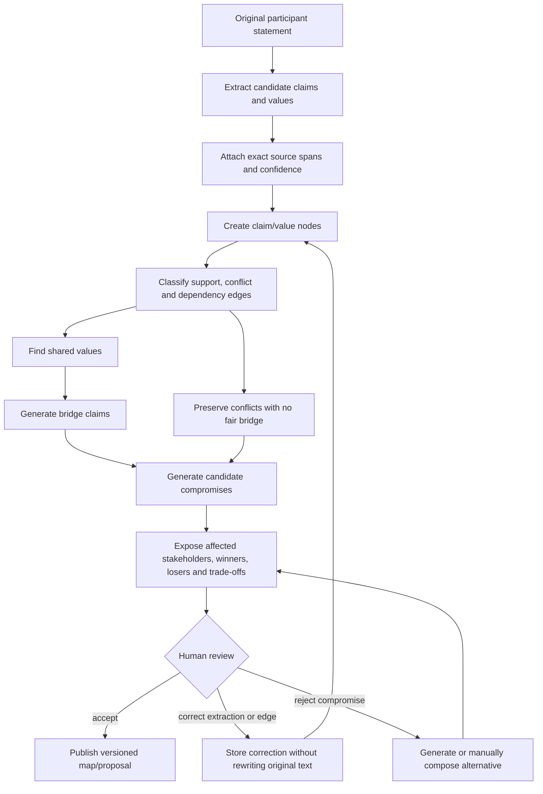
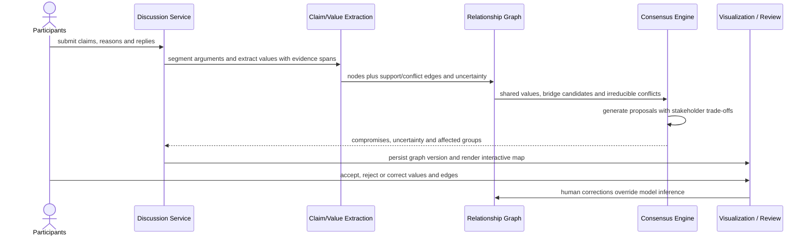

# DivergentUnity - AI-Powered Consensus Building Platform

> Bridge divides through intelligent debate analysis and AI-mediated compromise

An innovative platform that uses Google Gemini AI to help people with opposing viewpoints find common ground. It analyzes debates in real-time, extracts underlying values, identifies areas of agreement, and generates AI-mediated compromises.


## Quick Start

### 1. Get a Gemini API Key (Free)
Visit [Google AI Studio](https://makersuite.google.com/app/apikey) and create an API key.

### 2. Run Setup
```bash
chmod +x setup.sh
./setup.sh
```

### 3. Add Your API Key
Edit `backend/.env` and add your key:
```
GEMINI_API_KEY=your_actual_key_here
```

### 4. Start the Application
```bash
chmod +x start.sh
./start.sh
```

Open **http://localhost:3000** in your browser!

**See [QUICKSTART.md](QUICKSTART.md) for detailed instructions**

## Architecture

### Tech Stack

**Backend:**
- FastAPI (Python 3.10+)
- SQLModel (SQLAlchemy + Pydantic)
- SQLite database
- Google Generative AI (Gemini 1.5 Flash)

**Frontend:**
- Next.js 14 (App Router)
- TypeScript
- Tailwind CSS
- TanStack Query (React Query)
- Recharts for visualizations
- Lucide React icons

### Database Schema

```
Conversation (1) → (N) Utterance
                ↓
         ValueNode (extracted values)
                ↓
         RelationEdge (supports/contradicts)
                ↓
         AlignmentEdge (common ground)
```

### AI Services Pipeline

1. **NLP Extraction** - Extract values from text using Gemini
2. **Value Graph Builder** - Build relationship network
3. **Alignment Engine** - Find common ground between speakers
4. **Consensus Map** - Generate visualization data
5. **Compromise Generator** - Synthesize balanced solutions

## API Endpoints

### Conversations
- `POST /api/conversation` - Create new conversation
- `GET /api/conversation/{id}` - Get conversation with full graph
- `POST /api/conversation/{id}/utterance` - Add participant statement

### AI Generation
- `POST /api/compromise/{id}` - Generate AI compromise
- `POST /api/conversation/{id}/summary` - Generate neutral summary

### Analytics
- `GET /api/analytics/sessions` - List all sessions
- `GET /api/analytics/impact` - Platform-wide metrics
- `GET /api/analytics/conversation/{id}/timeline` - Tension/empathy over time
- `GET /api/analytics/conversation/{id}/quality` - Debate quality score

View interactive docs at **http://localhost:8000/docs**

## How It Works

1. **Input**: Users provide a topic and opposing perspectives (2-8 participants)
2. **Analysis**: Gemini AI extracts underlying values from each statement
3. **Mapping**: System identifies relationships (support/contradiction) between values
4. **Alignment**: AI finds common ground between different speakers
5. **Compromise**: Gemini generates a balanced solution honoring both sides
6. **Visualization**: Interactive consensus map shows the complete picture

### Value Categories

The system detects 8 types of values:
- **Safety** - Protection, security, risk avoidance
- **Freedom** - Liberty, autonomy, independence
- **Fairness** - Justice, equality, equity
- **Tradition** - Heritage, customs, proven methods
- **Progress** - Innovation, change, advancement
- **Community** - Collective good, solidarity
- **Autonomy** - Self-determination, choice
- **Responsibility** - Duty, accountability

## Project Structure

```
divergentunity/
├── backend/
│   ├── main.py                      # FastAPI application
│   ├── models.py                    # Database models
│   ├── schemas.py                   # Pydantic schemas
│   ├── database.py                  # DB configuration
│   ├── services/
│   │   ├── nlp_extraction.py        # AI value extraction
│   │   ├── value_graph_builder.py   # Relationship mapping
│   │   ├── alignment_engine.py      # Common ground detection
│   │   ├── consensus_map.py         # Visualization generation
│   │   ├── compromise_generator.py  # AI compromise creation
│   │   └── analytics.py             # Metrics calculation
│   └── requirements.txt
│
└── frontend/
    ├── app/
    │   ├── page.tsx                 # Home page
    │   ├── analysis/[id]/           # Analysis page
    │   ├── summary/[id]/            # Results page
    │   ├── analytics/               # Analytics dashboard
    │   └── layout.tsx
    ├── lib/
    │   ├── api.ts                   # API client
    │   └── types.ts                 # TypeScript types
    └── package.json
```

## Testing

```bash
# Test backend API
./test_backend.sh

# Manual testing
curl http://localhost:8000
```

## Development

See [DEVELOPMENT.md](DEVELOPMENT.md) for:
- Detailed setup instructions
- Architecture documentation
- API reference
- Customization guide
- Troubleshooting tips

## Example Use Cases

- **Policy Debates**: Climate change, healthcare, education
- **Team Decisions**: Remote work policies, project priorities
- **Community Issues**: Local development, resource allocation
- **Personal Conflicts**: Family decisions, relationship issues

## Contributing

Contributions welcome! Please:
1. Fork the repository
2. Create a feature branch
3. Make your changes
4. Submit a pull request

## License

MIT License - see LICENSE file

## Acknowledgments

- Google Gemini AI for advanced language understanding
- FastAPI for excellent Python web framework
- Next.js team for the amazing React framework
- Open source community

## Support

- Read [QUICKSTART.md](QUICKSTART.md) for setup help
- Check [DEVELOPMENT.md](DEVELOPMENT.md) for technical details
- Report issues on GitHub
- Join discussions in Issues

---

**Built with love for better conversations and understanding**

<!-- architecture-atlas-v5:start -->
## Architecture Atlas v5

These editable Mermaid diagrams mirror the [Notion architecture dossier](https://app.notion.com/p/3b467342e8c18163b5aaf76dc4a923d7?pvs=204).

### 1. Consensus anatomy

```mermaid
flowchart LR
  UI["Participants + debate UI"] --> API["Discussion/session API"]
  API --> TEXT[("Verbatim claims, reasons and replies")]
  TEXT --> SEG["Claim segmenter"] --> VALUE["Value-ontology mapper"] --> SPAN["Evidence-span linker"]
  SPAN --> GRAPH[("Versioned claim/value graph")]
  GRAPH --> EDGE["Support/conflict edge classifier"]
  EDGE --> ALIGN["Shared-value and alignment detector"]
  EDGE --> CONFLICT["Irreducible-conflict detector"]
  ALIGN --> BRIDGE["Bridge-claim finder"]
  BRIDGE --> COMP["Candidate compromise generator"]
  CONFLICT --> COMP
  COMP --> FAIR["Fairness, stakeholder and uncertainty annotator"]
  FAIR --> REVIEW["Human correction workflow"]
  REVIEW --> GRAPH
  FAIR --> MAP["Interactive consensus map + proposal comparison"]
```



### 2. Evidence-to-proposal wiring



### 3. Runtime narrative



### 4. Reliability model

```mermaid
stateDiagram-v2
  [*] --> DISCUSSION_OPEN
  DISCUSSION_OPEN --> EXTRACTING --> GRAPHING --> ALIGNMENT --> PROPOSING --> HUMAN_REVIEW
  HUMAN_REVIEW --> PUBLISHED: accepted with visible uncertainty
  HUMAN_REVIEW --> REVISED: correction or rejection
  REVISED --> GRAPHING: extraction/edge correction
  REVISED --> PROPOSING: alternative proposal
```

<!-- architecture-atlas-v5:end -->
